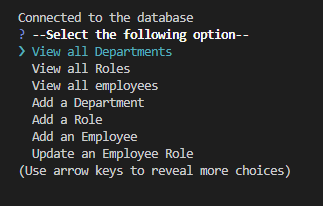

# Employee-Tracker 💻

## Description

This application allows business owners to manage their company's employee database efficiently.It provides an intuitive interface for viewing and interacting with data stored in a PostgresSQL database using Node.js and inquirier package.

## Installation

## Usage

[see the walkthrough video here]() 

 it will demonstrate how this application works. it should like the picture below:

## Credits

## License
This project is licensed under 
